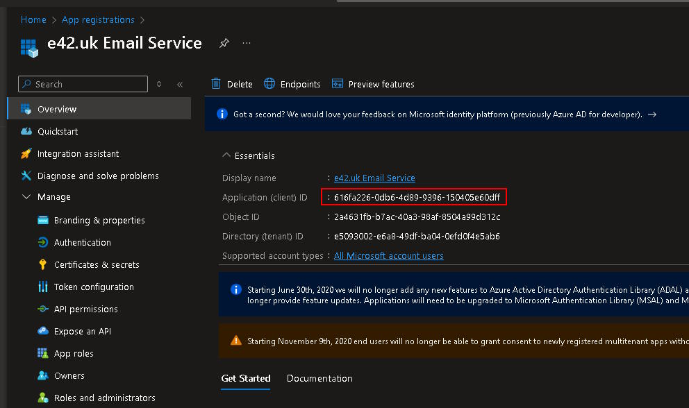
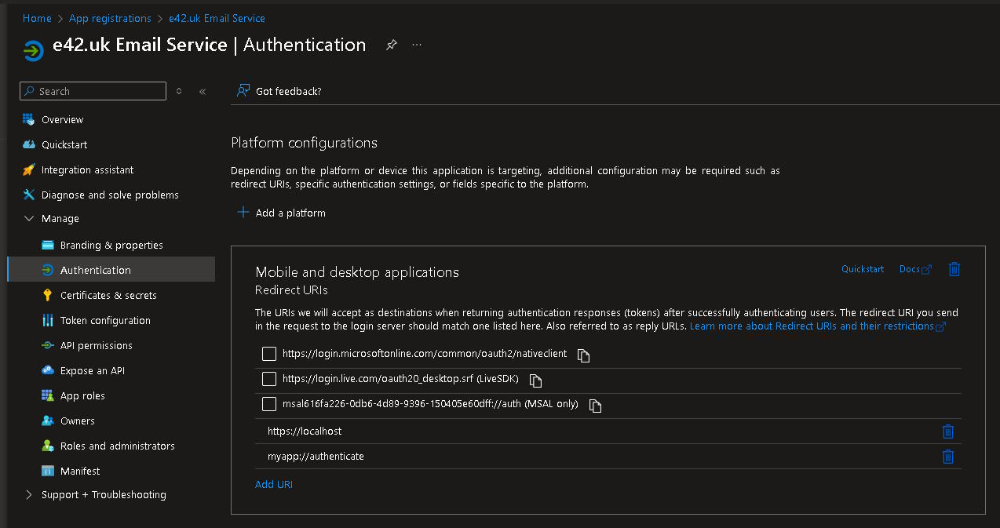
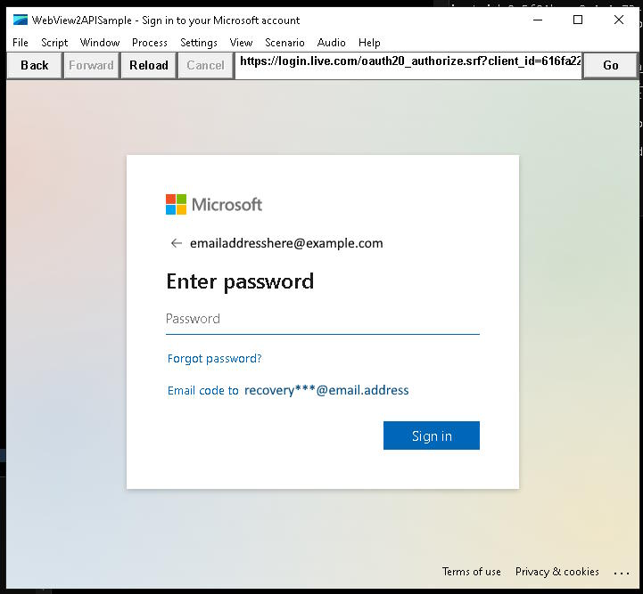
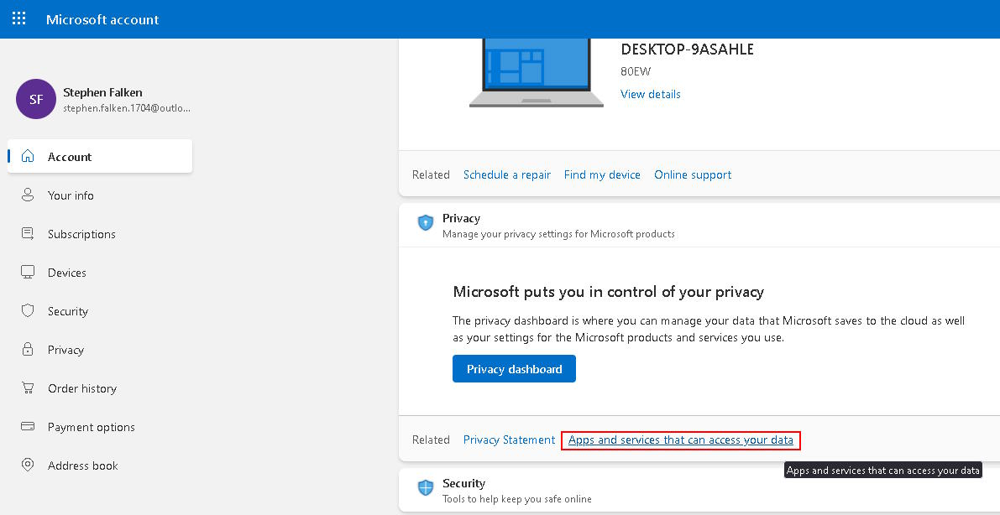
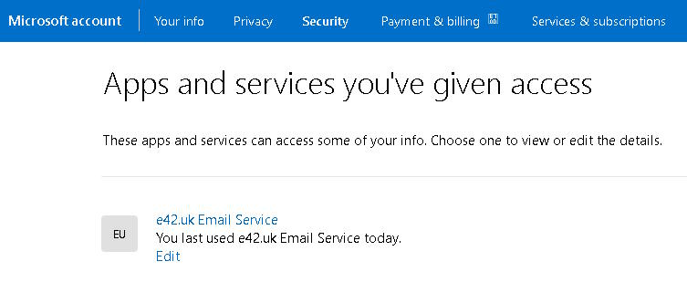

# OAuth Flow for Microsoft OpenID Connect

**IMPORTANT NOTE** `access_token` and `refresh_token`, especially `refresh_token` are sensitive
and should be handled with care. The tokens in this document are real but have been revoked!

All OpenID Connect providers will have a well known endpoint where various settings are stored.
For Microsoft, and for the general case that location is:

    https://login.microsoftonline.com/common/v2.0/.well-known/openid-configuration

I say this is the general case as there are different endpoints for hosted services, one example
of this is:

    https://login.microsoftonline.com/<tennant>/v2.0/.well-known/openid-configuration

The first step is to construct the request URI, nothing special is required and the authorize
url base should be taken from the above `openid-configuration` but is unlikely to change so
could probably be hard coded as major changes would probably require logic updates anyway:

    https://login.microsoftonline.com/common/oauth2/v2.0/authorize
    ?client_id=616fa226-0db6-4d89-9396-150405e60dff
    &redirect_uri=https%3A%2F%2Flocalhost
    &scope=https%3A%2F%2Foutlook.office.com%2FSMTP.Send%20offline_access
    &response_type=code
    &access_type=offline
	&state=thisissomestate123
    &login_hint=stephen.falken.1704%40outlook.com

The base url is contained in `authorization_endpoint`.

The values are quite self-explanatory but we will run through each individually:

### client_id

This is the identifier that Microsoft will provide for your application when registered in
the azure portal.

### redirect_uri

This is a required parameter and MUST match one of the acceptable URLs registered with the
application on the Azure portal.

It is probably best to use the URI that ends with `nativeclient` if possible since that makes
most sense for a desktop application.

### scope

This is a list of permissions that are being requested, these scopes will be present in the
JWT that we eventually get back from Microsoft and will be used by the specific service
to determine that the presented token is permitted to access that resource. In our case
we wish to send email and so the SMTP scope is specified, scopes are separated by space:

    https://outlook.office.com/SMTP.Send offline_access

### response_type

This is what we want back from the server

### access_type

We are not using an online service and so this is set to `offline`

### state

This value will be sent back to the client with the `code` and should be checked to verify
that the requests match.

### login_hint

This will allow the user to skip the box that asks them to type in their username. In some
cases the username and email address will be different, that will likely be the case for
some customers with a Microsoft hosted domain.

# Redirect to Microsoft

The user should then be directed to the constructed URL which will redirect a few times
and present the user with the normal Microsoft login page:

# Return from Microsoft

Upon successful return from the provider the url will be the `redirect_uri` complete with
the query string containing the values we requested (in this case `code` and `state`).

    https://localhost/
	?code=M.C544_BAY.2.U.1668c749-a245-7ef6-214a-cc25a0931f31
	&state=thisissomestate123

Upon failure the application will still direct the user to the redirect_uri but will
provide a different query string.

    https://localhost/
	?error=access_denied
	&error_description=The%20user%20has%20denied%20access%20to%20the%20scope%20requested%20by%20the%20client%20application.

# Requesting Access Tokens

The `state` and `code` values may then be used by the application to verify that the
response is as expected and sent to Microsoft to gain an access token respectively.

To request an access token from Microsoft the application must compose the following
request to send to the `token_endpoint`:

    client_id=9e5f94bc-e8a4-4e73-b8be-63364c29d753
	&code=M.C544_BAY.2.U.1668c749-a245-7ef6-214a-cc25a0931f31
	&redirect_uri=https%3A%2F%2Flocalhost
	&grant_type=authorization_code

These should all be on one line and POSTed to the `token_endpoint`
(`https://login.microsoftonline.com/common/oauth2/v2.0/token`).

The response will be something like this:

    {
    "token_type":"Bearer",
    "scope":"https://outlook.office.com/SMTP.Send https://outlook.office.com/IMAP.AccessAsUser.All https://outlook.office.com/POP.AccessAsUser.All",
    "expires_in":3600,
    "ext_expires_in":3600,
    "access_token":"EwBoA+l3BAAUcDnR9grBJokeAHaUV8R3+rVHX+IAAWfgj0qOQTcYldAdymm9IxkGmtsFK20yiduusXQJTM9t3skfnp7yShy+pOUvaA4DKzpxkyvh/7nhq+XdRlYbQbmJQwIiLzQHfaeXEFv02Mrv2PdvIu+iJYCrriVsg08v+rslEz1uuDqn4jHCXmZzDWhZTiILgGorfpOjl8zHWGtKY0jRWVN+LI0H4icw4FPTKx0xaqODdx+Vo0rYOZKhi6O2Sh8zzHS7dUrjevdn2aaVIsad58a76Z6zye6bMl29MDVrZK+I5qKvZPdYxIJANd06hJK9DZdFilRBDayNX6vx3RfVsS0cO02dACX0UqFNi5Iarty2XViYYTVA/Ar1pMAQZgAAEKn3AYUSAoyKCqQWWiYZsZIwAuvzlSxdXEeX1sWhQZR5l5BgYIsQO5u2oi055g22J9iH7Qs6ZncHSqzMGZfmHsn2eq+G0YG2+EBc5XQ8+i+9pgGWr0b3m9pGnZucHXKazU/oxjCWalMbUHbOh2lZ/JdoHsRWtRK57uyH+gppg7nbo4PZTcdIn8oBs/O6M2KYb04odYcDtFoK6Z971QfSZ0pjgtErBoSEYQrF6rCI2ibJwIZ404lePlV/51/eZi2IsMv1xNyhv0bEeMvQRvHGZLNEFaEpDHZY/RjxPN3HOsR/Y3FjCsxpUSpGvy5oi8+jZrcct1ggdJZ6f3YpohPo2SJ1E/7uNdAbIv6CyzRrPM9/3lwYl81F1Kd22dNsqoe8g0Jg51bMdzJKt2WJIFkIHEPbpIUCpWYzFZSa1b1UTcUfYESoW0Y8bfjkTfk4/xR/8mnDNohDoiQ9MD7dUrAV3l8GkcI9f9arr2FzG/wfX4ro4t6XHzH5PtO9Kk/qrZtcIlQfOmdjEGaT6KgODHH3mTMjATQK92KqQ5xhGqu+hONyCyMEd4Y3Pu09Qrn1xmf9Y2W9iMbUP6ch4xz9EY620I7yVufgO4N8/NoVGv/oVtV4HvnFEeSERl4r0uOem7y2sRB+oTqZOzFjz2ctAbwOWEMNEdpPsp1E4ffdfYWaloHPfeiZb5Grk7ZSpvGiNAUzaGkvz2jpqp/be3Nv6za/yKfNuuFwnzI7cgBfeR5KfAsSZrrmLc4pGO+d4bkeq22K0XJWXgI=",
	"refresh_token":"M.C544_SN1.0.U.-CiwMHYAx1hhi4J2gilq782rKzF5MeyubM5BkTyjzSkiTBB5r8xUDOFIaWQx1*S1QBTqjuw9lngCz1qde2cRf*nOdfaglVGQoxl!yv7LrgHHJ6BZXz3j2IVMRiuElVvfBez!XfGtYxfYqRp64EK!CGKwNwQjlP88e9w5gWecJpTxahWtWjmX5c49sK!LpyeUjGl3HOe77hPstVmYIcbii!Uw0sftkYeiKE2ApLDeO84zTyLDX7jZoCHj*2QFM2KGCSgTQLvQBYN!qFGqQxTRRdiJywZKGWsi*TjKy9L9MtNzmVtbVxG4oOmvCAI5Zz9!2geSstRzHP5KTQtQNBD1Pk4!0OHZcnE8i3aTwvdQsVg7SpkCvd8X24!tZH1PqsXicd7ZIA8S4s3NEzKSyEsRc7Jw$"
    }

The important part for the SMTP authentication dance is the `access_token`.

    EHLO clienthostname
    250-mangoes.tree.outlook.office365.com Hello [8.8.8.8]
    250-SIZE 157286400
    250-PIPELINING
    250-DSN
    250-ENHANCEDSTATUSCODES
    250-AUTH LOGIN XOAUTH2
    250-8BITMIME
    250-BINARYMIME
    250-CHUNKING
    250 SMTPUTF8
    AUTH PLAIN AHN0ZXBoZW4uZmFsa2VuLjE3MDRAb3V0bG9vay5jb20ATk9UUkVRVUlSRUQ=
    504 5.7.4 Unrecognized authentication type [mangoes.tree.PROD.OUTLOOK.COM 2025-01-12T18:10:12.989Z AAAA]
    AUTH XOAUTH2
    334 
    dXNlcj1zdGVwaGVuLmZhbGtlbi4xNzA0QG91dGxvb2suY29tAWF1dGg9QmVhcmVyIEV3Qm9BK2wzQkFBVWNEblI5Z3JCSm9rZUFIYVVWOFIzK3JWSFgrSUFBV2ZnajBxT1FUY1lsZEFkeW1tOUl4a0dtdHNGSzIweWlkdXVzWFFKVE05dDNza2ZucDd5U2h5K3BPVXZhQTRES3pweGt5dmgvN25ocStYZFJsWWJRYm1KUXdJaUx6UUhmYWVYRUZ2MDJNcnYyUGR2SXUraUpZQ3JyaVZzZzA4dityc2xFejF1dURxbjRqSENYbVp6RFdoWlRpSUxnR29yZnBPamw4ekhXR3RLWTBqUldWTitMSTBINGljdzRGUFRLeDB4YXFPRGR4K1ZvMHJZT1pLaGk2TzJTaDh6ekhTN2RVcmpldmRuMmFhVklzYWQ1OGE3Nlo2enllNmJNbDI5TURWclpLK0k1cUt2WlBkWXhJSkFOZDA2aEpLOURaZEZpbFJCRGF5Tlg2dngzUmZWc1MwY08wMmRBQ1gwVXFGTmk1SWFydHkyWFZpWVlUVkEvQXIxcE1BUVpnQUFFS24zQVlVU0FveUtDcVFXV2lZWnNaSXdBdXZ6bFN4ZFhFZVgxc1doUVpSNWw1QmdZSXNRTzV1Mm9pMDU1ZzIySjlpSDdRczZabmNIU3F6TUdaZm1Ic24yZXErRzBZRzIrRUJjNVhROCtpKzlwZ0dXcjBiM205cEduWnVjSFhLYXpVL294akNXYWxNYlVIYk9oMmxaL0pkb0hzUld0Uks1N3V5SCtncHBnN25ibzRQWlRjZEluOG9Ccy9PNk0yS1liMDRvZFljRHRGb0s2Wjk3MVFmU1owcGpndEVyQm9TRVlRckY2ckNJMmliSndJWjQwNGxlUGxWLzUxL2VaaTJJc012MXhOeWh2MGJFZU12UVJ2SEdaTE5FRmFFcERIWlkvUmp4UE4zSE9zUi9ZM0ZqQ3N4cFVTcEd2eTVvaTgralpyY2N0MWdnZEpaNmYzWXBvaFBvMlNKMUUvN3VOZEFiSXY2Q3l6UnJQTTkvM2x3WWw4MUYxS2QyMmROc3FvZThnMEpnNTFiTWR6Skt0MldKSUZrSUhFUGJwSVVDcFdZekZaU2ExYjFVVGNVZllFU29XMFk4YmZqa1RmazQveFIvOG1uRE5vaERvaVE5TUQ3ZFVyQVYzbDhHa2NJOWY5YXJyMkZ6Ry93Zlg0cm80dDZYSHpINVB0TzlLay9xclp0Y0lsUWZPbWRqRUdhVDZLZ09ESEgzbVRNakFUUUs5MktxUTV4aEdxdStoT055Q3lNRWQ0WTNQdTA5UXJuMXhtZjlZMlc5aU1iVVA2Y2g0eHo5RVk2MjBJN3lWdWZnTzROOC9Ob1ZHdi9vVnRWNEh2bkZFZVNFUmw0cjB1T2VtN3kyc1JCK29UcVpPekZqejJjdEFid09XRU1ORWRwUHNwMUU0ZmZkZllXYWxvSFBmZWlaYjVHcms3WlNwdkdpTkFVemFHa3Z6MmpwcXAvYmUzTnY2emEveUtmTnV1Rnduekk3Y2dCZmVSNUtmQXNTWnJybUxjNHBHTytkNGJrZXEyMkswWEpXWGdJPQEB
    235 2.7.0 Authentication successful

The first base64 encoded portion of the above is:

    00000000  00 73 74 65 70 68 65 6e  2e 66 61 6c 6b 65 6e 2e  |.stephen.falken.|
    00000010  31 37 30 34 40 6f 75 74  6c 6f 6f 6b 2e 63 6f 6d  |1704@outlook.com|
    00000020  00 4e 4f 54 52 45 51 55  49 52 45 44              |.NOTREQUIRED|

This plain login is just for demonstration, of course this will not work, it is not
an advertised authentication type. The next base64 encoded portion of the above is
the XOAUTH2 authentication:

    00000000  75 73 65 72 3d 73 74 65  70 68 65 6e 2e 66 61 6c  |user=stephen.fal|
    00000010  6b 65 6e 2e 31 37 30 34  40 6f 75 74 6c 6f 6f 6b  |ken.1704@outlook|
    00000020  2e 63 6f 6d 01 61 75 74  68 3d 42 65 61 72 65 72  |.com.auth=Bearer|
    00000030  20 45 77 42 6f 41 2b 6c  33 42 41 41 55 63 44 6e  | EwBoA+l3BAAUcDn|
    00000040  52 39 67 72 42 4a 6f 6b  65 41 48 61 55 56 38 52  |R9grBJokeAHaUV8R|
    00000050  33 2b 72 56 48 58 2b 49  41 41 57 66 67 6a 30 71  |3+rVHX+IAAWfgj0q|
    00000060  4f 51 54 63 59 6c 64 41  64 79 6d 6d 39 49 78 6b  |OQTcYldAdymm9Ixk|
    00000070  47 6d 74 73 46 4b 32 30  79 69 64 75 75 73 58 51  |GmtsFK20yiduusXQ|
    ...
    000004a0  53 5a 72 72 6d 4c 63 34  70 47 4f 2b 64 34 62 6b  |SZrrmLc4pGO+d4bk|
    000004b0  65 71 32 32 4b 30 58 4a  57 58 67 49 3d 01 01     |eq22K0XJWXgI=..|

# Refresh Token

The token provided is very short lived (1 hour / 3600 seconds) it is possible to request a new
`access_token` using the `refresh_token` that was returned from the Microsoft above.

# Revocation

Users may revoke the access at any time via the Microsoft Account dashboard:

# Summary

The authentication process is now complete and the application may perform a standard
SMTP email sending transaction (`MAIL FROM:<stephen.falken.1704@outlook.com>` etc.)
